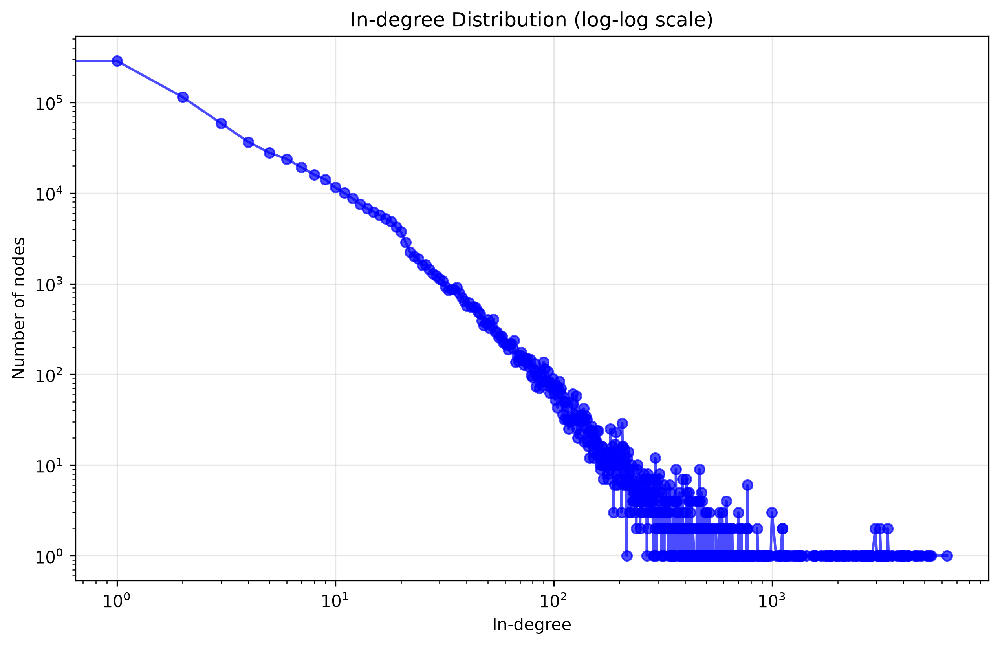

# Search Ranking &amp; Link Analysis Pipeline

Implements and **evaluates** the core machinery behind a web search engine: ranking models scored against each other with standard IR metrics, plus link analysis over a real **875,000-node** web graph.

The focus is measurement. Any ranker can return results — the question is whether they're *good*, and the only way to answer that is to score them.

## Ranking models

Three approaches ranked over the same query, then compared head to head:

| Model | Approach |
|---|---|
| **Single-feature** | Ranks by one feature value — a baseline to beat |
| **BM25** | Probabilistic relevance with term-frequency saturation and length normalisation |
| **Query-likelihood** | Language model with **Dirichlet smoothing** against collection statistics |

## Evaluation metrics

All implemented from scratch — this is the part that matters:

- **DCG / nDCG@k** — discounted cumulative gain, normalised against the ideal ranking, so relevant results ranked *lower* are penalised
- **Precision@k** and **Recall@k**
- **Mean Average Precision** — rewards ranking relevant documents early, not just retrieving them

## Link analysis

Over the SNAP `web-Google` graph (~875K nodes, ~5.1M edges):

- **PageRank** — random-walk importance with damping
- **HITS** — hubs and authorities
- **In-degree distribution** — plotted log-log, showing the power-law shape characteristic of real web graphs



It also computes the **Spearman correlation between PageRank and raw in-degree** — testing whether PageRank actually says something beyond "count the inbound links."

## Running it

```bash
pip install -r requirements.txt
python search_pipeline.py
```

### Datasets (not committed — they're ~94 MB)

| File | Source |
|---|---|
| `data.txt` | [MSLR-WEB learning-to-rank dataset](https://www.microsoft.com/en-us/research/project/mslr/) |
| `web-Google.txt` | [SNAP web-Google graph](https://snap.stanford.edu/data/web-Google.html) |

Place both in the repository root. Link analysis is skipped gracefully if `web-Google.txt` is absent, so the ranking half runs without the large download.

> **Note:** the query ID analysed is set by `target_qid` in `main()`. Pick one that exists in your copy of the dataset — document counts per query vary between MSLR releases.

## Tests

```bash
python -m pytest tests/ -q
```

13 tests covering the metrics against hand-calculated values — nDCG is verified to equal exactly 1.0 for ideal ordering and to penalise reversed ordering, and Average Precision is checked against a worked example. Also covers dataset parsing and ranker ordering.

## Built with

Python 3 · NetworkX (PageRank, HITS) · SciPy (Spearman) · Matplotlib
